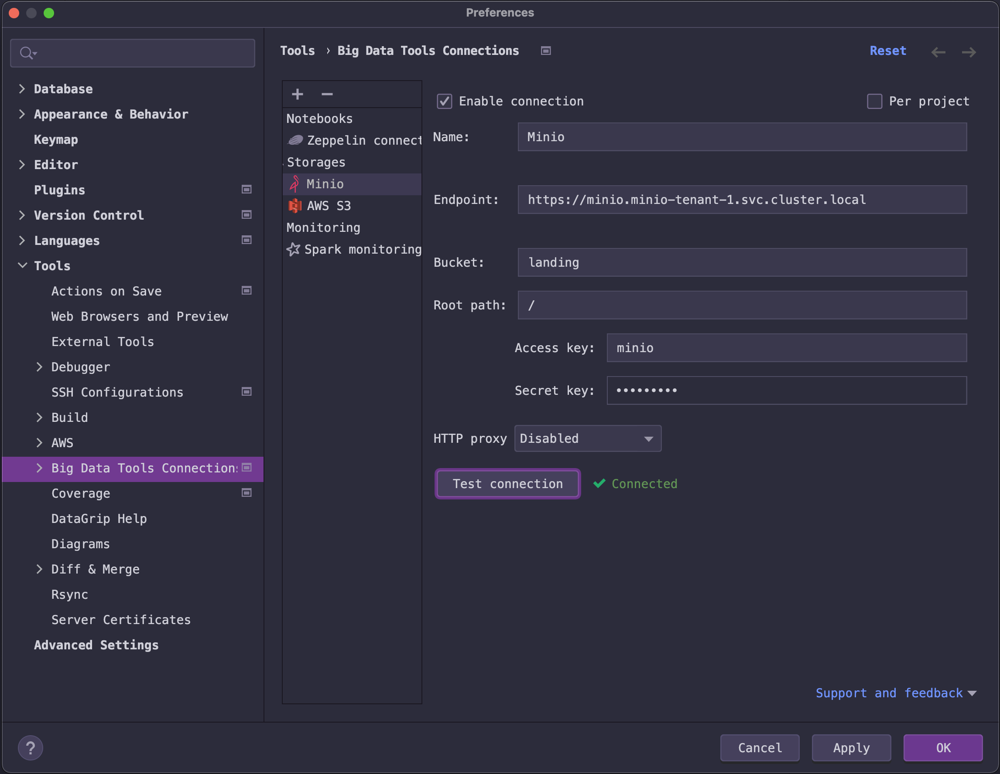

```commandline
(                                                                                                                                              ─╯
  set -x; cd "$(mktemp -d)" &&
  OS="$(uname | tr '[:upper:]' '[:lower:]')" &&
  ARCH="$(uname -m | sed -e 's/x86_64/amd64/' -e 's/\(arm\)\(64\)\?.*/\1\2/' -e 's/aarch64$/arm64/')" &&
  curl -fsSLO "https://github.com/kubernetes-sigs/krew/releases/download/v0.4.2/krew-darwin_amd64.tar.gz" &&
  tar zxvf krew-darwin_amd64.tar.gz &&
  KREW=./krew-"${OS}_${ARCH}" &&
  "$KREW" install krew
)
```

```commandline
kubectl krew update
kubectl krew install minio
kubectl minio version
kubectl minio init --namespace minio-operator
```

```commandline
kubectl get deployments -A --field-selector metadata.name=minio-operator
```

```commandline
kubectl create ns minio-tenant-1
```
```commandline
kubectl minio tenant create minio-tenant-1 \
--servers          3                     \
--volumes          6                     \
--capacity         100Gi                 \
--namespace        minio-tenant-1        \
--storage-class minio-local-storage
```

```text
I1216 17:38:37.190045   21518 tenant-create.go:69] create tenant command started

Tenant 'minio-tenant-1' created in 'minio-tenant-1' Namespace

  Username: admin
  Password: 7286b02c-8db6-4083-93d6-ea9184ad2e95
  Note: Copy the credentials to a secure location. MinIO will not display these again.

+-------------+------------------------+----------------+--------------+--------------+
| APPLICATION | SERVICE NAME           | NAMESPACE      | SERVICE TYPE | SERVICE PORT |
+-------------+------------------------+----------------+--------------+--------------+
| MinIO       | minio                  | minio-tenant-1 | ClusterIP    | 443          |
| Console     | minio-tenant-1-console | minio-tenant-1 | ClusterIP    | 9443         |
+-------------+------------------------+----------------+--------------+--------------+
```

```commandline
kubectl minio tenant delete minio-tenant-1 --namespace minio-tenant-1
kubectl delete ns minio-tenant-1
kubectl delete pv/local-storage-pv000{1,2,3,4,5,6}
minikube --node=cluster2     ssh "sudo rm -rf /data/local-storage/pv000{1,2,3,4,5,6}/.minio.sys"
minikube --node=cluster2-m02 ssh "sudo rm -rf /data/local-storage/pv000{1,2,3,4,5,6}/.minio.sys"
minikube --node=cluster2-m03 ssh "sudo rm -rf /data/local-storage/pv000{1,2,3,4,5,6}/.minio.sys"
minikube --node=cluster2     ssh "sudo rm -rf /data/local-storage/pv000{1,2,3,4,5,6}/*"
minikube --node=cluster2-m02 ssh "sudo rm -rf /data/local-storage/pv000{1,2,3,4,5,6}/*"
minikube --node=cluster2-m03 ssh "sudo rm -rf /data/local-storage/pv000{1,2,3,4,5,6}/*"
```
# Minio certificate
   * https://github.com/minio/minio/tree/master/docs/tls/kubernetes: How to secure access to MinIO on Kubernetes with TLS
   * "*.minio-tenant-1-hl.minio-tenant-1.svc.cluster.local"

```commandline
openssl genrsa -out private.key 2048
openssl req -new -x509 -nodes -days 730 -key private.key -out public.crt -config openssl.conf
```

```commandline
echo -n | openssl s_client -connect minio-tenant-1-console.minio-tenant-1.svc.cluster.local:9443
```
```commandline
cd cert
openssl x509 -in public.crt -noout -text
```

```text
Certificate:
    Data:
        Version: 3 (0x2)
        Serial Number:
            07:c5:51:de:60:80:41:cd:1e:a2:62:94:55:a7:8a:69
    Signature Algorithm: sha256WithRSAEncryption
        Issuer: CN=minikubeCA
        Validity
            Not Before: Dec 17 12:35:16 2021 GMT
            Not After : Dec 17 12:35:16 2022 GMT
        Subject: O=system:nodes, CN=system:node:*.minio-tenant-1-hl.minio-tenant-1.svc.cluster.local
        Subject Public Key Info:
            Public Key Algorithm: id-ecPublicKey
                Public-Key: (256 bit)
                pub:
                    04:5a:b3:d2:28:0a:7f:c7:09:0b:55:3d:91:6b:ab:
                    30:ce:76:0e:7e:a5:43:1e:14:3e:6d:bb:42:9b:58:
                    7e:0b:24:2d:19:b6:01:5e:65:90:93:63:ee:45:be:
                    38:e2:f8:93:48:e1:a0:74:d6:22:da:67:42:56:93:
                    1a:08:47:fc:33
                ASN1 OID: prime256v1
                NIST CURVE: P-256
        X509v3 extensions:
            X509v3 Key Usage: critical
                Digital Signature, Key Encipherment
            X509v3 Extended Key Usage:
                TLS Web Server Authentication, TLS Web Client Authentication
            X509v3 Basic Constraints: critical
                CA:FALSE
            X509v3 Authority Key Identifier:
                keyid:7F:AD:08:47:FE:DF:54:AE:C2:8A:FE:08:86:8F:7E:56:F6:5C:BE:BA

            X509v3 Subject Alternative Name:
                DNS:minio-tenant-1-ss-0-{0...2}.minio-tenant-1-hl.minio-tenant-1.svc.cluster.local, DNS:minio.minio-tenant-1.svc.cluster.local, DNS:minio.minio-tenant-1, DNS:minio.minio-tenant-1.svc, DNS:*.minio-tenant-1-hl.minio-tenant-1.svc.cluster.local, DNS:*.minio-tenant-1.svc.cluster.local
    Signature Algorithm: sha256WithRSAEncryption
         10:fd:c1:09:ae:1a:fc:c1:b2:c1:17:76:ca:b5:3b:65:47:04:
         bb:30:32:28:aa:8f:ea:0c:a6:c7:35:14:df:cd:3a:96:69:aa:
         66:29:56:f2:39:79:3c:56:5b:60:81:ae:c9:6a:01:21:34:66:
         ea:df:77:2a:4d:1f:cd:57:8e:d2:ec:b9:9d:f4:a4:84:92:63:
         3b:fc:94:2f:0a:92:f0:2e:d8:9a:95:c3:19:b5:f1:47:57:3b:
         2c:42:19:11:b9:1e:19:be:98:0c:d5:9b:5c:c5:5b:a1:0c:a0:
         fe:88:9d:28:cf:55:b1:8c:b3:04:95:9d:7d:0c:c0:e4:9f:4f:
         99:9a:bc:80:ab:be:84:67:6a:f8:ef:9f:3e:04:de:0f:6b:5d:
         42:26:e3:ff:77:5b:6d:35:94:32:41:6a:81:01:30:19:0e:90:
         92:33:29:84:34:1f:f8:6c:19:92:27:25:5f:0d:60:c8:2f:9c:
         52:3d:80:55:77:b9:42:c8:58:0c:19:ec:2d:cf:a6:7a:2c:7c:
         42:da:c8:a1:17:4a:52:c5:c4:f1:b0:fb:25:1d:15:6e:6a:ed:
         96:5c:42:65:70:21:37:cb:87:8e:66:16:ec:06:0c:48:fc:08:
         26:11:79:a1:db:a4:b9:ad:ae:ba:e8:4e:7a:b5:a9:1b:62:90:
         5b:e9:69:40
```

# Minio console
   * https://minio-tenant-1-console.minio-tenant-1.svc.cluster.local:9443/: Minio console

```commandline
kubeclt minio proxy
```
# Minio API
   * https://minio.minio-tenant-1.svc.cluster.local

# Issues
##  Jetbrains DataGrip Minio connection: Unable to execute HTTP request: PKIX path building failed: sun.security.provider.certpath.SunCertPathBuilderException: unable to find valid certification path to requested target
   * https://intellij-support.jetbrains.com/hc/en-us/community/posts/115000094584-IDEA-Ultimate-2016-3-4-throwing-unable-to-find-valid-certification-path-to-requested-target-when-trying-to-refresh-gradle

   * Get the certificate. It's the same as the file "cert/public.crt"
```commandline
echo -n | openssl s_client -connect minio.minio-tenant-1.svc.cluster.local:443 | sed -ne '/-BEGIN CERTIFICATE-/,/-END CERTIFICATE-/p' > /tmp/public.crt
```
   * Add certificate to key store
```commandline
cd cert
keytool -keystore cacerts -importcert -alias minio-cert -file public.crt
keytool --keystore cacerts --list
keytool --keystore cacerts --list | grep minio
```
   * Use the default password of "changeit"




* Use the default password of "changeit"
```commandline
cd "/Applications/IntelliJ IDEA.app/Contents/jbr/Contents/Home/lib/security"
"/Applications/IntelliJ IDEA.app/Contents/jbr/Contents/Home/bin/keytool" -keystore cacerts -importcert -alias minio-cert -file /tmp/public.crt
"/Applications/IntelliJ IDEA.app/Contents/jbr/Contents/Home/bin/keytool" -keystore cacerts -list
```
# Minio client
   * https://docs.min.io/docs/minio-client-complete-guide: MinIO Client Complete Guide
```commandline
brew install minio/stable/mc
```

# AWS S3 
   * https://docs.min.io/docs/aws-cli-with-minio.html: AWS CLI with MinIO Server 
   * https://stackoverflow.com/questions/32946050/ssl-certificate-verify-failed-in-aws-cli: SSL CERTIFICATE_VERIFY_FAILED in aws cli
   * https://docs.aws.amazon.com/cli/latest/userguide/cli-configure-envvars.html: Environment variables to configure the AWS CLI
## Configure
```commandline
aws configure
```
## List files
```commandline
aws --no-verify-ssl  --endpoint-url https://minio.minio-tenant-1.svc.cluster.local s3 ls
```

## Copy file
```commandline
aws --no-verify-ssl  --endpoint-url https://minio.minio-tenant-1.svc.cluster.local s3 cp ./cluster.local s3://landing
```

# Reference
   * https://docs.min.io/minio/k8s/reference/minio-kubectl-plugin.html: MinIO Kubernetes Plugin
   * https://docs.min.io/minio/k8s/deployment/deploy-minio-operator.html#deploy-operator-kubernetes
      * https://github.com/minio/operator: MinIO Operator
   * https://blog.travismclarke.com/post/osx-cli-group-management/: OSX User/Group Management – Part 2: Groups
   * https://docs.min.io/minio/k8s/tenant-management/deploy-minio-tenant-using-commandline.html#deploy-minio-tenant-commandline
      * "MinIO strongly recommends using locally attached drives on each node intended to support the MinIO Tenant. MinIO’s strict read-after-write and list-after-write consistency model requires local disk filesystems (xfs, ext4, etc.). MinIO also shows best performance with locally-attached drives."
